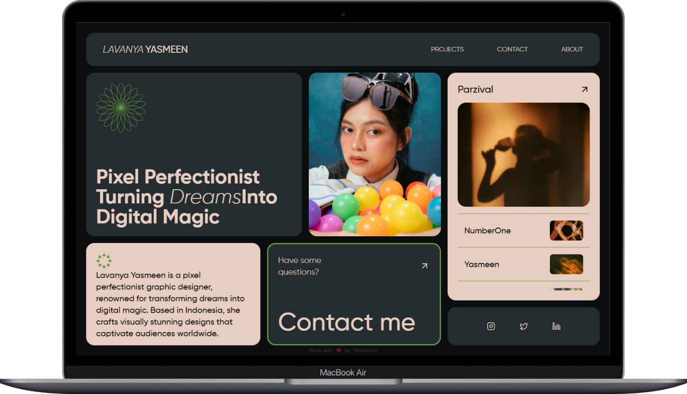
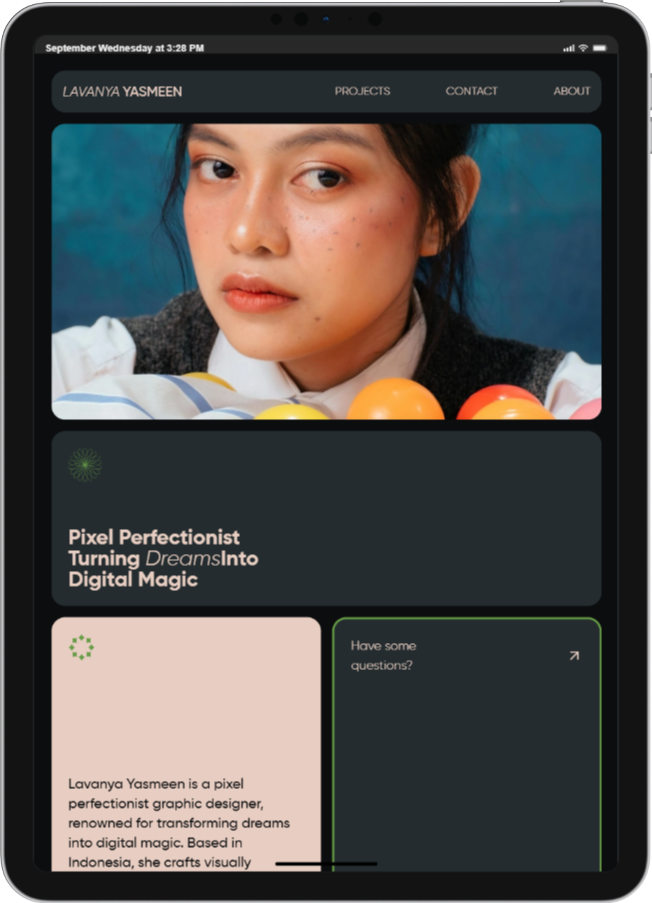
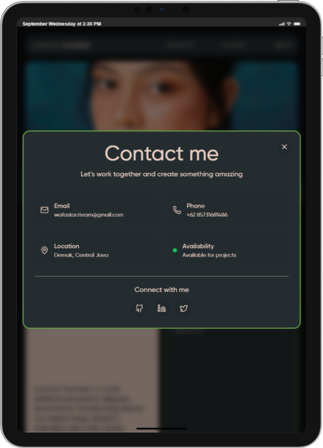
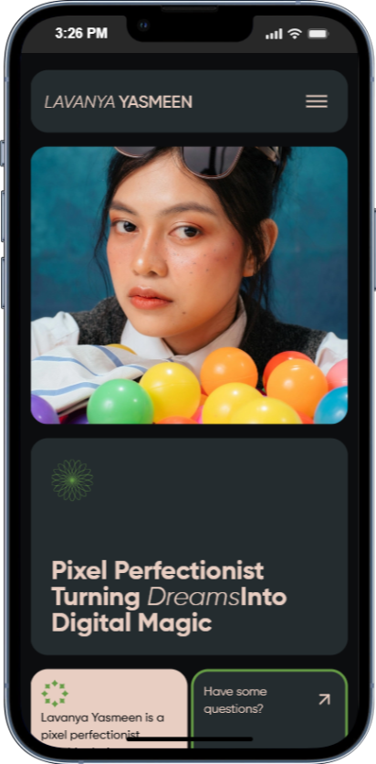
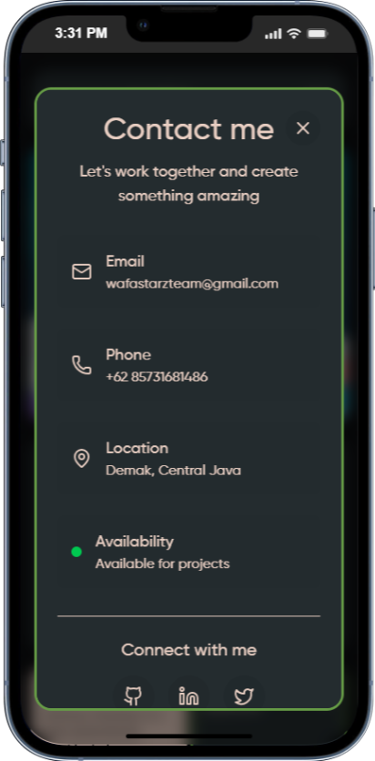

<div align="center">

# 🍱 Bentofolio

[](https://opensource.org/licenses/MIT)
[](https://nextjs.org/)
[](https://reactjs.org/)
[](https://tailwindcss.com/)

A modern, animated bento-style portfolio template built with cutting-edge web technologies. Perfect for developers and designers who want to showcase their work with style.

[View Demo](https://lavanya-bentofolio.vercel.app) · [Report Bug](https://github.com/mkhoirulwafa18/bentofolio/issues) · [Request Feature](https://github.com/mkhoirulwafa18/bentofolio/issues)

</div>

## ✨ Preview

<p align="center">
  <video src="docs/preview/lavanya-bento-preview.webm" autoplay loop muted playsinline alt="Bentofolio — homepage overview"></video>
</p>

## 📸 Screenshots

<p align="center">
  
  
</p>
<p align="center">
  
  
  
  
</p>

## 🚀 Features

### Core Features
- 📱 Fully responsive bento-grid layout
- 🎯 SEO optimized with Next.js
- 🎨 Modern UI with Tailwind CSS
- ✨ Smooth animations powered by Motion
- 📦 Zero-config deployment

### Technical Highlights
- 🔥 Server-side rendering with Next.js 15
- 🎭 Animated interactions via Motion variants
- 📱 Mobile-first responsive design
- ♿ ARIA-compliant accessibility features
- 🎨 Custom theming with CSS variables
- 🔤 Local font optimization with `next/font`

## 🛠️ Tech Stack

- **Framework:** Next.js 15 (Turbopack)
- **UI Library:** React 19
- **Styling:** Tailwind CSS v4
- **Animation:** Motion (Framer Motion API)
- **Icons:** Lucide React
- **Utilities:** clsx, tailwind-merge

## 📦 Getting Started

### Prerequisites

- Node.js 18 or later
- npm or yarn package manager

### Installation

1. Clone the repository
   ```bash
   git clone https://github.com/mkhoirulwafa18/bentofolio.git
   cd bentofolio
   ```

2. Install dependencies
   ```bash
   npm install
   # or
   yarn install
   ```

3. Set up environment variables
   ```bash
   cp .env.example .env.local
   ```
   Then edit `.env.local` with your configuration

4. Start the development server
   ```bash
   npm run dev
   # or
   yarn dev
   ```

5. Open [http://localhost:3000](http://localhost:3000) in your browser

### Build for Production
   ```bash
   npm run build
   # or
   yarn build
   ```

## 📁 Project Structure

```
bentofolio/
├── public/
│   ├── fonts/                 # Local Gilroy font files
│   ├── projects/              # Project thumbnail images
│   ├── svgs/                  # SVG icons and graphics
│   └── person2.jpg            # Profile image
├── src/
│   ├── app/
│   │   ├── globals.css        # Global styles and CSS variables
│   │   ├── layout.tsx         # Root layout with metadata
│   │   └── page.tsx           # Home page composition
│   ├── components/
│   │   ├── AboutContactSection.tsx
│   │   ├── ContactModal.tsx
│   │   ├── HamburgerButton.tsx
│   │   ├── HeroSection.tsx
│   │   ├── MobileNav.tsx
│   │   ├── Navbar.tsx
│   │   ├── PersonImageSection.tsx
│   │   └── ProjectsSection.tsx
│   ├── hooks/
│   │   └── useNavigation.ts   # Navigation state management
│   └── lib/
│       ├── animation/         # Motion variants and animations
│       ├── constants/         # Centralized data (contact, projects, etc.)
│       └── utils/             # Utility functions
├── .gitignore
├── eslint.config.mjs
├── next.config.ts
├── package.json
├── postcss.config.mjs
├── README.md
└── tsconfig.json
```

## 🔧 Available Scripts

- `npm run dev` - Start development server with Turbopack
- `npm run build` - Build for production with Turbopack
- `npm run start` - Start production server
- `npm run lint` - Run ESLint for code quality

## 🎨 Customization

### Content Management
All content is centralized in `src/lib/constants/` for easy customization:

- **Hero Content**: Edit `src/lib/constants/siteContent.ts`
- **Contact Info**: Edit `src/lib/constants/contact.ts`
- **Social Links**: Edit `src/lib/constants/socials.ts`
- **Projects**: Edit `src/lib/constants/projects.ts`
- **Navigation**: Edit `src/lib/constants/navItems.ts`

### Styling & Theming
- **CSS Variables**: Modify `src/app/globals.css` for colors and spacing
- **Fonts**: Replace files in `public/fonts/` and update `src/app/layout.tsx`
- **Images**: Replace `public/person2.jpg` and project images in `public/projects/`

### SEO & Metadata
Update metadata in `src/app/layout.tsx` for:
- Page title and description
- Open Graph tags
- Twitter card settings
- Author information

## 🤝 Contributing

Contributions are welcome! Please follow these steps:

1. **Fork the repository**
   ```bash
   git clone https://github.com/mkhoirulwafa18/bentofolio.git
   ```

2. **Create a feature branch**
   ```bash
   git checkout -b feature/amazing-feature
   ```

3. **Install dependencies**
   ```bash
   npm install
   ```

4. **Make your changes**
   - Follow the existing code style
   - Add comments for complex logic
   - Test your changes locally

5. **Commit your changes**
   ```bash
   git commit -m "feat: add amazing feature"
   ```

6. **Push to your branch**
   ```bash
   git push origin feature/amazing-feature
   ```

7. **Open a Pull Request**

### Development Guidelines
- Use TypeScript for type safety
- Follow the existing component structure
- Maintain responsive design principles
- Test on multiple screen sizes
- Ensure accessibility standards

## 📄 License

This project is licensed under the MIT License - see the [LICENSE](LICENSE) file for details.

### MIT License Summary
- ✅ Commercial use
- ✅ Modification
- ✅ Distribution
- ✅ Private use
- ❌ Liability
- ❌ Warranty

## 🙏 Acknowledgments

- [Next.js](https://nextjs.org/) - The React framework for production
- [Tailwind CSS](https://tailwindcss.com/) - Utility-first CSS framework
- [Motion](https://motion.dev/) - Animation library
- [Lucide React](https://lucide.dev/) - Beautiful & consistent icons
- [Vercel](https://vercel.com/) - Deployment platform

---

<div align="center">
  <p>Made with ❤️ by <a href="https://github.com/mkhoirulwafa18">Wafastarz</a></p>
  <p>⭐ Star this repo if you found it helpful!</p>
</div>
